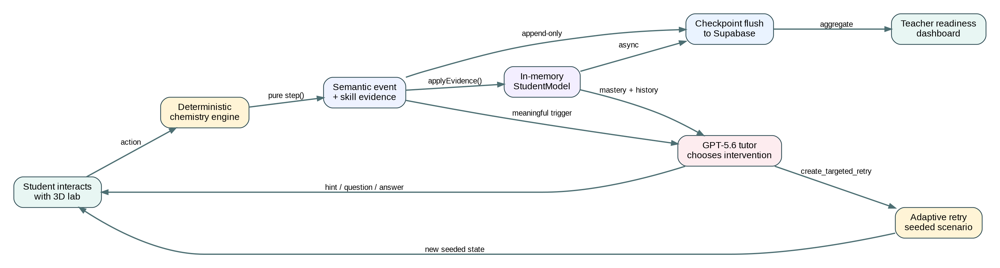
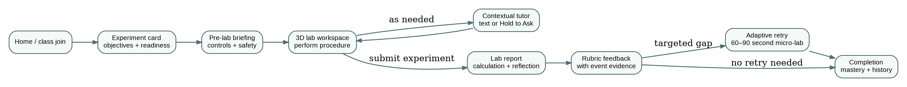
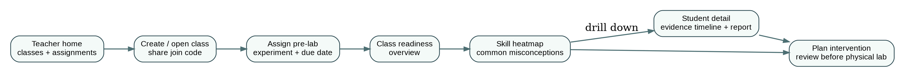
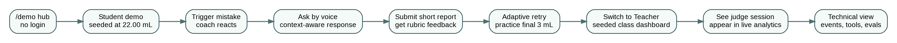
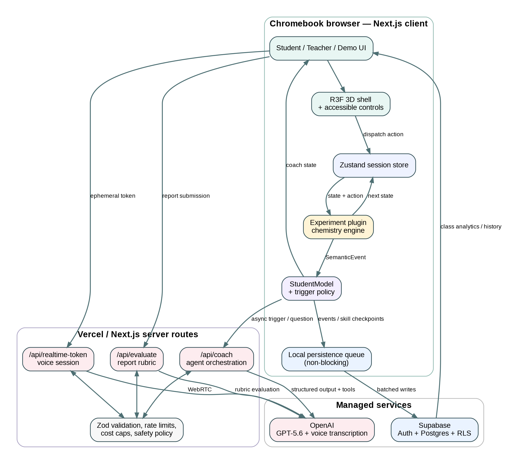
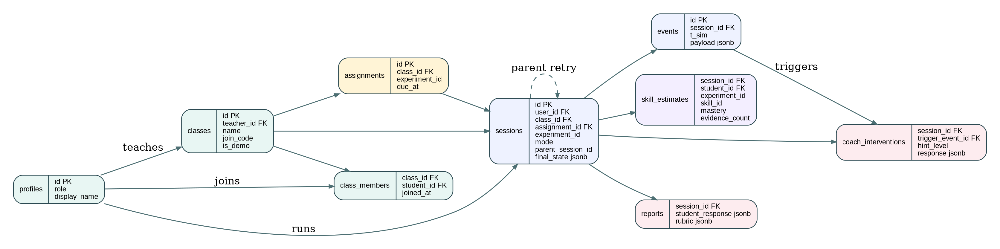

# Virtual Chemistry Lab
## Product, UX, Architecture, and Agent Build Specification

**Working title:** LabBench AI (replaceable)  
**Document status:** Build-ready v1.0  
**Primary build target:** OpenAI Build Week — Education track  
**Primary users:** High-school chemistry students, chemistry teachers, and hackathon judges  
**Primary platform:** Chromebook-class browser hardware  
**Implementation stack:** Next.js + TypeScript + React Three Fiber + Zustand + Supabase + OpenAI  

> **Normative instruction for coding agents:** Treat this document as the product and architecture source of truth. Preserve the listed invariants. Do not invent chemistry inside UI components, let an LLM mutate simulation state, or replace deterministic metrics with model-generated estimates.

---

# 1. Product thesis

Many students enter a physical chemistry laboratory having read a procedure but without understanding how individual actions affect the experiment. Teachers often discover procedural misconceptions only after students have wasted reagents, produced unusable data, or become overwhelmed at the bench.

Virtual Chemistry Lab is an **AI-native pre-lab rehearsal environment**. Students manipulate realistic laboratory equipment in a lightweight first-person 3D web environment. A deterministic local chemistry engine models the experiment and emits structured evidence about what the student did. An AI tutor observes those events, asks context-aware questions, provides graduated hints, and creates targeted retry scenarios. Teachers receive a readiness dashboard showing which skills and misconceptions need review before the class performs the physical laboratory.

The product is not “a 3D lab with a chatbot.” Its differentiating loop is:

1. Observe a student’s actual laboratory actions.
2. Convert actions into deterministic semantic evidence.
3. Diagnose procedural and conceptual gaps.
4. Coach without interrupting every action.
5. Generate a focused retry when useful.
6. Persist skill evidence.
7. Surface class-level readiness to the teacher.



## 1.1 Positioning statement

> A virtual chemistry lab that does not merely simulate chemistry—it understands how a student is learning chemistry.

## 1.2 Product promise

Students should finish a session able to answer both:

- **What do I do next?**
- **Why does that action matter to the quality of my result?**

Teachers should finish with:

- a reliable class readiness snapshot,
- concrete misconceptions to review,
- identifiable students who need additional support,
- evidence grounded in student actions rather than model intuition.

## 1.3 Educational position

The product prepares students for hands-on laboratory work; it does not replace physical laboratory instruction. It should be marketed as a rehearsal, formative assessment, and teacher planning tool—not as a substitute for real equipment, safety supervision, or laboratory experience.

---

# 2. Goals, non-goals, and success criteria

## 2.1 Product goals

### G1. Make procedural understanding observable
Capture meaningful student actions such as conditioning glassware, controlling addition rate, reading a meniscus, choosing an indicator, and interpreting measurements.

### G2. Keep scientific truth deterministic
All chemistry calculations, state transitions, tolerances, and hidden ground truth execute locally through pure TypeScript functions. GPT-5.6 never computes pH, endpoint volume, precipitate identity, heat transfer, or grading ground truth.

### G3. Provide context-aware tutoring without becoming annoying
The tutor should react only to semantic transitions, repeated confusion, or direct student questions. Routine successful actions should usually produce silence.

### G4. Personalize practice
When a student demonstrates a meaningful gap, the system should create a short seeded retry scenario focused on that skill rather than forcing a full experiment restart.

### G5. Give teachers actionable evidence
Teacher metrics must be traceable to persisted sessions, events, skill estimates, and reports. The LLM may summarize data but may not fabricate percentages or mastery scores.

### G6. Run on the hardware schools actually have
The laboratory must remain usable on a 4 GB Chromebook with integrated graphics and an ordinary trackpad.

### G7. Be immediately demoable
A judge must reach the product’s “aha” moment without authentication, onboarding, or waiting through a full experiment.

## 2.2 Non-goals for the Build Week version

- Full rigid-body or fluid physics.
- Freeform manipulation of every object in the room.
- Photorealistic graphics.
- Multiplayer laboratory sessions.
- High-stakes summative grading.
- Replacing teacher safety instruction.
- A comprehensive chemistry curriculum.
- An unconstrained general-purpose chatbot.
- Letting the LLM directly write simulation state or database rows.
- Building three separate experiment applications; all experiments must use one shared plugin framework.

## 2.3 Success criteria

The build is successful when all of the following are true:

1. A student can complete the hero titration from setup through report feedback.
2. The chemistry remains functional when OpenAI or Supabase is unavailable.
3. A meaningful mistake produces a relevant coaching intervention within a perceived two seconds.
4. A routine successful action does not produce unnecessary coaching.
5. A completed session updates real persisted teacher analytics.
6. Adaptive Retry can launch from a valid intermediate experiment seed.
7. The judge can experience student, teacher, and technical views from `/demo` without logging in.
8. The hero path sustains at least 30 FPS on the target Chromebook profile.
9. Seeded-error evals report intervention recall and false-intervention behavior.
10. A second experiment proves that the plugin architecture generalizes without duplicating the shell, coach, evaluator, or persistence layer.

---

# 3. Users and jobs to be done

## 3.1 Student persona

**Who:** High-school chemistry student preparing for a physical laboratory. May be curious and self-directed, anxious about laboratory procedures, or using a low-spec school Chromebook.

**Jobs:**

- Understand the purpose of each laboratory step.
- Practice equipment handling without fear of wasting materials.
- Ask questions while hands are occupied.
- Learn from mistakes without being given the answer immediately.
- Know whether they are ready for the physical lab.

**Desired emotional state:** “I know what to do, I understand why, and I am less nervous about the real lab.”

## 3.2 Teacher persona

**Who:** High-school chemistry teacher assigning pre-lab practice to one or more classes.

**Jobs:**

- Assign or share a rehearsal quickly.
- See who completed it.
- Identify class-wide misconceptions before the physical lab.
- Drill into evidence for students who need support.
- Decide what to reteach in a five-minute pre-lab briefing.

**Desired emotional state:** “I know where the class is likely to struggle before students touch the equipment.”

## 3.3 Judge persona

**Who:** Build Week judge with approximately three minutes and no patience for setup.

**Jobs:**

- Experience the student-facing “aha” moment immediately.
- See that the tutor is grounded in actual actions and state.
- See the student-to-teacher data loop work.
- Understand why GPT-5.6 and Codex are central rather than decorative.
- Verify technical depth through architecture, event traces, and evals.

**Desired emotional state:** “This is polished, technically rigorous, meaningfully agentic, and clearly useful.”

---

# 4. Scope and priority

## 4.1 P0 — required for a prize-competitive submission

1. Shared experiment plugin framework.
2. Polished acid–base titration.
3. First-person 3D laboratory workspace with constrained, reliable interactions.
4. Deterministic chemistry engine and property/unit tests.
5. Semantic event stream and in-memory StudentModel.
6. Contextual AI coach with structured outputs and hint escalation.
7. Text question input.
8. “Hold to Ask” voice input, with graceful fallback to text.
9. End-of-lab report and rubric-scored feedback.
10. Adaptive Retry for endpoint control and at least one additional skill.
11. Supabase persistence, one-click Google sign-in, roles, classes, and join codes.
12. Teacher class readiness dashboard over real data.
13. Dedicated `/demo` environment with one-click Student, Teacher, and Technical views.
14. Seeded judge titration starting near endpoint.
15. Seeded-but-real teacher class data plus live insertion of the judge’s own session.
16. Headless coaching eval harness.
17. Chromebook performance pass.

## 4.2 P1 — strong evidence of extensibility

1. Precipitation/solubility experiment plugin.
2. Student history and past report view.
3. Teacher individual-student detail page.
4. Event replay or compact evidence timeline.
5. Teacher assignment creation and due dates.
6. Additional adaptive retry templates.
7. Robust offline write queue using IndexedDB.

## 4.3 P2 — only after the P0 loop is excellent

1. Calorimetry experiment.
2. Flame-test visual mini-lab.
3. Rich class trend charts.
4. Teacher-authored rubrics or custom lab configurations.
5. Additional accessibility alternatives for every 3D action.
6. More advanced mastery modeling.

## 4.4 Experiment order

1. **Acid–base titration:** hero experience and deepest implementation.
2. **Precipitation/solubility:** visually compelling proof of the plugin architecture.
3. **Calorimetry:** broadens pedagogy and report analysis after the core loop is stable.
4. **Flame test:** optional visual stretch.

---

# 5. Information architecture and routes

```text
/
├── /experiments
├── /join/[classCode]
├── /lab/[experimentId]
│   ├── ?mode=practice
│   ├── ?mode=assignment
│   └── /report
├── /student
│   ├── /history
│   └── /sessions/[sessionId]
├── /teacher
│   ├── /classes
│   ├── /classes/[classId]
│   ├── /classes/[classId]/assignments/[assignmentId]
│   └── /classes/[classId]/students/[studentId]
├── /demo
│   ├── /student
│   ├── /teacher
│   └── /technical
└── /api
    ├── /coach
    ├── /evaluate
    ├── /realtime-token
    ├── /sessions/checkpoint
    └── /demo/reset
```

## 5.1 Route behavior

- `/` is a concise landing page with “Try a lab,” “Teacher dashboard,” and “Judge demo” entry points.
- `/experiments` is accessible to guests. Authentication is never required to try the core student experience.
- `/join/[classCode]` asks for Google sign-in only when the student wants their session attached to a class.
- `/lab/[experimentId]` loads the experiment plugin and shell. The chemistry route chunk is lazy-loaded.
- `/teacher/*` requires the teacher role except inside `/demo/teacher`.
- `/demo/*` never requires authentication and always shows a persistent role switcher and reset control.

---

# 6. Student experience



## 6.1 Student journey overview

1. Enter as a guest or join a teacher’s class.
2. Select an experiment or open an assignment.
3. Review objectives, controls, and a concise safety/preparation note.
4. Enter the 3D bench.
5. Perform the procedure through direct object interactions.
6. Receive contextual questions or graduated hints only when useful.
7. Ask the tutor questions by text or voice while working.
8. Submit measurements, calculations, and a short explanation.
9. Receive rubric feedback grounded in the action trace and deterministic ground truth.
10. Complete a targeted retry if the system identifies a high-value gap.
11. See completion and readiness results.

## 6.2 Student screen 1 — home / experiment selection

### Purpose
Let the student start quickly while establishing learning objectives.

### Layout

- Top navigation: logo, Experiments, My History, Teacher, Sign In/Profile.
- Hero: “Practice the lab before you enter it.”
- Experiment cards:
  - title,
  - 3D preview image,
  - estimated time,
  - difficulty,
  - skills practiced,
  - status: Available / Assigned / Coming Soon.
- Class join box: six-character code.

### Titration card

- **Title:** Acid–Base Titration
- **Estimated time:** 8–12 minutes
- **Skills:** burette conditioning, endpoint control, volumetric reading, stoichiometry
- **Primary CTA:** Start practice
- **Secondary CTA:** View objectives

### Acceptance criteria

- Guest can begin in one click.
- Assigned students can see the teacher/class context.
- No account creation blocks the demo-critical flow.

## 6.3 Student screen 2 — pre-lab briefing

### Purpose
Teach controls and clarify the experiment’s objective without giving away the result.

### Content

- Objective: determine the unknown acid concentration using a standardized base.
- Equipment list with selectable visual thumbnails.
- Three concise interaction instructions:
  1. Drag the view or use arrow keys to look around.
  2. Click an object to focus it.
  3. Use the object control panel for precise laboratory actions.
- Safety note: simulation only; follow the teacher’s real laboratory safety instructions in the physical lab.
- Optional “Procedure outline” that names stages but does not reveal exact answers.
- “Enter lab” CTA.

### Interaction philosophy

The experience looks first-person, but it is not a freeform physics sandbox. The student focuses an object and uses realistic constrained controls. This produces reliable, accessible, testable actions.

Examples:

- Click burette → focused view → rinse/fill controls.
- Drag stopcock control → changes modeled flow rate.
- Click flask → swirl action.
- Click meniscus → eye-level zoom and reading input.

## 6.4 Student screen 3 — 3D laboratory workspace

### Desktop/Chromebook layout

```text
┌──────────────────────────────────────────────────────────────────────┐
│ Acid–Base Titration   Stage 3 of 5   07:24   Save ✓   Reset   Help │
├─────────────────────────────────────────────┬────────────────────────┤
│                                             │ AI Lab Coach           │
│                                             │ ─────────────────────  │
│           FIRST-PERSON 3D BENCH             │ [context messages]     │
│                                             │                        │
│  burette      flask      indicator          │ Ask a question…        │
│                                             │ [Hold to Ask 🎙]        │
│                                             │                        │
├─────────────────────────────────────────────┼────────────────────────┤
│ Focused tool controls / measurements        │ Lab notebook / curve   │
└─────────────────────────────────────────────┴────────────────────────┘
```

### Core regions

#### A. Top session bar

- Experiment title.
- Current stage label; not a rigid step lock.
- Session timer.
- Persistence state: Saved / Saving / Offline—will sync.
- Reset with confirmation.
- Help/accessibility controls.

#### B. 3D canvas

- Fixed standing location at a low-poly laboratory bench.
- Drag-look or pointer-lock optional; default must not trap the cursor.
- Clickable equipment uses a subtle outline or emissive highlight on hover.
- Camera transitions to focused equipment views; avoid nausea-inducing movement.
- No post-processing dependency.
- State visuals derive only from experiment state:
  - burette fluid level from `titrantAddedML`,
  - flask indicator color from deterministic `observedColor(...)`,
  - live curve from `state.curve`,
  - labels and measurements from display-format functions.

#### C. Focused tool controls

When an object is selected, show precise controls in a 2D panel. Examples:

**Burette controls**

- Rinse with: water / titrant.
- Fill with standardized NaOH.
- Stopcock control with discrete flow bands:
  - Closed,
  - Fast stream,
  - Slow stream,
  - Dropwise.
- Current displayed reading: rounded to burette tolerance.
- “Read meniscus” opens eye-level zoom and student input.

**Flask controls**

- Add indicator.
- Swirl.
- Inspect color.

**Lab notebook**

- Objective.
- Current recorded measurements.
- Optional procedure outline.
- Live pH curve when enabled for the activity.

#### D. AI Lab Coach panel

The panel has four message types with distinct labels:

- **Question:** Socratic prompt.
- **Hint 1/2/3:** graduated support.
- **Explanation:** response to direct student question or after retry.
- **Observation:** neutral consequence statement.

The coach should not use a chatty persona or comment on every action.

### Coach trigger rules

An unsolicited coaching request may occur only when one of these is true:

1. The latest event contains a new high-priority flag.
2. The same negative skill evidence repeats.
3. The student is inactive for a configured duration at a meaningful stage.
4. The student requests help.
5. A stage transition invites reflection.

Additional constraints:

- Maximum one unsolicited message per semantic event.
- Never send a coach request for raw mouse movement or continuous animation.
- Routine successful actions should generally remain silent.
- Do not repeat the same hint at the same level.
- Escalate only after evidence that the previous hint was insufficient.

### Voice: “Hold to Ask”

- Button sits beside the text input.
- Press and hold to record; release to submit.
- Show microphone state, live transcript, cancel gesture, and clear fallback to text.
- The transcript is sent with current experiment state, recent semantic events, and StudentModel.
- The tutor answers in text for P0. Spoken response is optional.
- Voice is an input modality, not a separate tutor with separate memory.

Example:

Student asks: “Why does going past the endpoint matter?”

Context passed to tutor:

- current volume: 26.0 mL,
- modeled equivalence: 25.0 mL,
- event flag: `endpoint_overshoot`,
- student skill estimate: endpoint control 0.37,
- last coach message and hint level.

Expected response:

> “You added more base than was needed to neutralize the acid. In the calculation, that larger recorded volume makes it look as though more acid was present than actually was. Which quantity in your molarity equation changes when the endpoint volume is too large?”

### Student interaction event examples

```json
{
  "type": "add_titrant",
  "tSim": 184.5,
  "observation": {
    "addedML": 2.0,
    "totalML": 26.0,
    "rateMlPerS": 2.0,
    "pH": 11.96,
    "observedColor": "pink",
    "equivalenceML": 25.0
  },
  "flags": [
    "flow_rate_high_near_endpoint",
    "endpoint_overshoot"
  ],
  "evidence": [
    {
      "skillId": "endpoint_control",
      "delta": -0.7,
      "reason": "flow_rate_high_near_endpoint"
    },
    {
      "skillId": "endpoint_control",
      "delta": -0.9,
      "reason": "endpoint_overshoot"
    }
  ]
}
```

## 6.5 Student screen 4 — report submission

### Purpose
Assess whether the student can connect procedure, data, calculation, and interpretation.

### Form structure

1. **Recorded measurements**
   - initial burette reading,
   - final burette reading,
   - volume delivered.
2. **Calculation**
   - known titrant molarity,
   - mole ratio,
   - calculated analyte molarity,
   - optional work/explanation field.
3. **Concept explanation**
   - “How did you decide the endpoint had been reached?”
   - “Describe one procedural choice that could bias the calculated concentration and why.”
4. **Confidence**
   - 1–5 self-rating.

### Submission behavior

- Client validates required fields and units.
- The deterministic engine supplies hidden ground truth.
- The evaluator receives the report, summarized action evidence, rubric, and ground truth.
- The report submission must not be blocked by a model timeout. Show “Report saved; feedback is loading” and stream or poll the result.

## 6.6 Student screen 5 — rubric feedback

### Rubric dimensions

- Concept understanding.
- Procedure.
- Data analysis/calculation.
- Significant figures.

### Each criterion displays

- score on a 0–4 scale,
- one-sentence strength,
- one specific improvement,
- evidence source:
  - report statement,
  - measurement,
  - or semantic event.

### Required design behavior

- Separate “scientific result” from “learning evidence.” A student may obtain the wrong final answer but show correct reasoning in part of the process.
- Do not shame mistakes.
- Do not claim certainty when evidence is ambiguous.
- Show a “Practice this skill” CTA when adaptive retry is available.

## 6.7 Student screen 6 — Adaptive Retry

### Purpose
Turn diagnosis into action.

### Retry design

A retry is a short, seeded micro-lab lasting 60–90 seconds. It reuses the same experiment plugin and shell.

Example: endpoint-control retry

```json
{
  "experimentId": "acid_base_titration",
  "targetSkill": "endpoint_control",
  "reason": "endpoint_overshoot",
  "seed": {
    "titrantAddedML": 22.0,
    "buretteConditioned": true,
    "titrantDilutionFactor": 1.0
  },
  "successCriteria": {
    "maxRateNearEndpointMlPerS": 0.5,
    "maxOvershootML": 0.3
  },
  "maxDurationS": 90
}
```

### Student experience

1. “Let’s retry only the final few milliliters.”
2. The lab opens at 22.00 mL with a valid backfilled curve.
3. The coach provides a concise goal, then remains quiet.
4. The student practices slowing to dropwise addition.
5. A deterministic success check evaluates performance.
6. The student sees a before/after skill result.

### Retry constraints

- The LLM selects from validated retry templates and supplies bounded parameters.
- The LLM never constructs arbitrary chemistry state.
- The server validates seed values against the experiment plugin’s retry schema.
- A retry session is persisted with `parent_session_id` and `mode = 'adaptive_retry'`.

## 6.8 Student screen 7 — completion and history

Display:

- completion status,
- readiness score for this experiment,
- skill cards,
- report score,
- completed retry skills,
- “Review feedback” and “Practice again.”

History is secondary to the teacher loop but should exist for authenticated students.

---

# 7. Teacher experience



## 7.1 Teacher journey overview

1. Sign in with Google.
2. Create a class or open an existing class.
3. Share a join code or link.
4. Assign a pre-lab experiment.
5. Open the readiness dashboard before the physical lab.
6. Inspect completion, class skill mastery, and misconceptions.
7. Drill into a student when needed.
8. Use the dashboard’s “Before class” briefing to decide what to reteach.

## 7.2 Teacher screen 1 — teacher home

### Layout

- Header: Teacher dashboard, profile, demo/help.
- Class cards:
  - class name,
  - student count,
  - active assignment,
  - completion percentage,
  - readiness status.
- “Create class” CTA.
- Recent activity feed.

### Create class

Minimum fields:

- class name,
- section/period optional,
- school year optional.

Output:

- six-character join code,
- shareable link.

## 7.3 Teacher screen 2 — class overview

### Header

- class name,
- join code with copy button,
- number of students,
- active assignment selector,
- “Assign experiment” CTA.

### Primary cards

1. **Completion**
   - completed / assigned.
2. **Class readiness**
   - 0–100 deterministic score.
3. **Needs attention**
   - number of students below threshold.
4. **Most common misconception**
   - reason tag plus plain-language label.

### Main visualization

**Skill readiness table/heatmap**

| Skill | Class mastery | Students ready | Needs review | Trend |
|---|---:|---:|---:|---:|
| Burette conditioning | 0.82 | 20 | 4 | — |
| Endpoint control | 0.67 | 15 | 9 | — |
| Volumetric reading | 0.74 | 18 | 6 | — |
| Stoichiometry | 0.58 | 12 | 12 | — |

P0 may omit trend if no historical assignment data exists.

### Common misconceptions panel

Examples:

- “Adds titrant too quickly near the endpoint” — 9 students.
- “Rinses the burette with water but not titrant” — 6 students.
- “Reads the meniscus outside ±0.05 mL” — 5 students.
- “Treats endpoint and equivalence point as identical observations” — 4 students.

Each row links to affected students and evidence.

### “Before class” briefing

A compact, optionally AI-written summary grounded in deterministic aggregates:

> “Review why addition rate should decrease near the endpoint. Nine of 24 students added titrant faster than the configured threshold, and six overshot by more than 0.3 mL. Consider demonstrating dropwise stopcock control before distributing reagents.”

The metric values must be supplied by SQL/API results. The model may phrase the recommendation but may not create numbers.

## 7.4 Teacher screen 3 — student roster

Columns:

- student name,
- completion status,
- readiness score,
- report score,
- strongest skill,
- skill needing review,
- last activity.

Filters:

- incomplete,
- needs attention,
- misconception reason,
- report score range.

## 7.5 Teacher screen 4 — student detail

### Summary

- student name,
- experiment,
- completion time,
- overall readiness,
- report score.

### Skill cards

For each skill:

- mastery estimate,
- evidence count,
- latest positive/negative reason,
- confidence note when evidence is sparse.

### Evidence timeline

Only pedagogically meaningful events, not every interaction:

```text
02:14  Rinsed burette with water
       Evidence: burette_conditioning −0.9
       Coach: asked student to predict effect of residual water

05:48  Added 2.0 mL in 1.0 s near endpoint
       Flags: high flow rate, endpoint overshoot
       Evidence: endpoint_control −0.7, −0.9

08:31  Completed adaptive retry successfully
       Evidence: endpoint_control +0.8
```

### Report

Show student response, rubric scores, and feedback.

### Privacy rule

Teachers see educationally relevant evidence. Raw voice audio is never stored. Voice transcript retention should be off by default or limited to the message needed for the session. Do not expose hidden chain-of-thought or internal model reasoning.

## 7.6 Deterministic teacher metrics

### Student readiness

For titration, default weights:

```text
burette_conditioning  0.25
endpoint_control      0.30
volumetric_reading    0.20
stoichiometry         0.25
```

```text
student_readiness = 100 × Σ(weight_i × mastery_i)
```

Weights live in experiment metadata so each plugin can define its own readiness function.

### Class skill mastery

```text
class_skill_mastery = average(latest mastery for completed students)
```

### Ready threshold

Default: mastery ≥ 0.70. Configurable later.

### Needs-attention rule

A student appears in “Needs attention” if any of the following is true:

- required skill mastery < 0.60,
- two or more strong negative evidence events occur for the same skill,
- report criterion score ≤ 1,
- assigned session is incomplete after due date.

### Common misconception rule

Show a reason when it affects at least:

- three students, or
- 20% of students with completed sessions,

whichever is smaller, with a floor of two students in very small classes.

---

# 8. Judge demo experience



## 8.1 Core principle

Judge Mode is a dedicated demo product surface, not a hidden query parameter in the normal application. It optimizes time-to-understanding while using the real engine, agent, persistence path, and dashboard.

## 8.2 `/demo` hub

### No authentication

The page opens directly and displays three large cards:

1. **Experience the Student Lab** — recommended first.
2. **View the Teacher Dashboard**.
3. **Inspect How It Works** — architecture, live event trace, tool calls, and eval results.

### Persistent demo bar

Visible on all `/demo/*` routes:

```text
DEMO MODE   [Student] [Teacher] [Technical]   [Reset demo]
```

Add a one-sentence guided instruction beneath the bar when useful. Do not create modal onboarding.

## 8.3 Student demo

### Initial state

- Experiment: strong-acid/strong-base titration.
- Burette conditioned correctly.
- Titrant added: 22.00 mL.
- Expected equivalence: approximately 25.00 mL.
- Curve backfilled consistently.
- Coach active.
- Session attached to an ephemeral judge identity within a dedicated demo class.

### Guided demo rail

A small optional panel says:

1. “Open the stopcock quickly and add about 2 mL.”
2. “Ask: Why does going past the endpoint matter?”
3. “Submit the short report.”
4. “Try the personalized retry.”
5. “Switch to Teacher to see your evidence appear.”

The judge may hide the guide.

### Required “aha” sequence

1. Judge adds titrant too quickly near endpoint.
2. Engine emits `flow_rate_high_near_endpoint` and `endpoint_overshoot`.
3. Coach asks a context-aware question rather than presenting a generic warning.
4. Judge asks a voice or text question.
5. Tutor references the actual action and measurement.
6. Judge submits a compact prefilled report with one intentionally flawed explanation.
7. Evaluator returns evidence-linked feedback.
8. Adaptive Retry starts at 22.00 mL.
9. Judge performs controlled addition and succeeds.
10. Teacher dashboard shows the judge session and updated skill evidence.

## 8.4 Teacher demo

### Seeded data

- Demo class: “AP Chemistry — Period 3.”
- 24 realistic student profiles.
- Sessions generated through the same engine/event schema or a validated seed generator.
- Mix of completion and common misconceptions.
- Seed data is clearly labeled “Demo class data.”

### Live judge session

The current browser’s demo student session appears as a highlighted row:

> “Your demo session — completed just now.”

Its metrics should be produced by the live persistence pipeline, not hardcoded into the dashboard.

## 8.5 Technical demo

This view is strongly recommended because it maps directly to technical implementation criteria.

### Panels

1. **Architecture diagram.**
2. **Live semantic event inspector.**
3. **Current StudentModel.**
4. **Latest agent input/output and tool calls.**
5. **Chemistry truth tests.**
6. **Coach eval table.**
7. **Performance budget.**
8. **Codex contribution summary.**

### Live trace example

```text
Action
add_titrant({ volumeML: 2.0, durationS: 1.0 })
        ↓
Engine event
flags: [flow_rate_high_near_endpoint, endpoint_overshoot]
        ↓
StudentModel
endpoint_control: 0.50 → 0.34
        ↓
Agent tool
record_diagnosis(endpoint_control, endpoint_overshoot)
        ↓
Coach response
“What change to the addition rate would give you more control?”
        ↓
Persistence
Event and skill checkpoint saved
```

## 8.6 Demo reset behavior

- Reset deletes or ignores only the current ephemeral judge session.
- Base seeded class data remains stable.
- Reset returns Student Demo to the 22.00 mL seed.
- No judge can corrupt the shared demo tenant.
- Prefer a browser-scoped demo run ID and server-enforced row ownership.

---

# 9. Experiment specifications

## 9.1 Shared experiment plugin contract

The existing `ExperimentDefinition<TConfig, TState, TAction>` is the architectural foundation. The 3D shell, tutor, evaluator, persistence layer, report flow, teacher analytics, and eval harness are each implemented once against this contract.

### Required invariants

1. `TConfig`, `TState`, `TAction`, events, and ground truth are serializable.
2. `step(state, action)` is pure and deterministic.
3. Identical state and action produce identical next state and events.
4. The engine emits only pedagogically meaningful `SemanticEvent` objects.
5. Events are both tutor inputs and persisted event records.
6. The LLM never computes or overrides scientific state.
7. `createInitialState(config, seed)` supports valid intermediate state seeding.
8. Every semantic flag is backed by at least one unit/eval scenario.
9. Every positive behavior that should remain silent has a false-intervention test.
10. Display precision is separate from internal full-precision state.

### Canonical interface

```ts
export interface ExperimentDefinition<TConfig, TState, TAction> {
  id: string;
  title: string;
  skills: SkillDefinition[];
  reportRubric: RubricCriterion[];

  createInitialState(config: TConfig, seed?: Partial<TState>): TState;
  step(state: TState, action: TAction): StepResult<TState>;
  getGroundTruth(state: TState): GroundTruth;
}
```

### Recommended metadata extension

Add metadata without changing the core reducer:

```ts
export interface ExperimentMetadata<TState> {
  description: string;
  estimatedMinutes: number;
  difficulty: "intro" | "intermediate" | "advanced";
  thumbnail: string;
  readinessWeights: Record<string, number>;
  stages: ExperimentStage[];
  retryTemplates: RetryTemplate<TState>[];
  ui: ExperimentUIManifest;
}
```

Keep metadata declarative and serializable.

## 9.2 Hero experiment — acid–base titration

### Scientific scope

- Monoprotic strong acid or weak acid.
- Strong-base titrant.
- 25 °C.
- Activity approximated by concentration.
- 50.00 mL burette readable to ±0.05 mL.
- Internal values retain full precision.
- Display layer applies equipment precision.

### Existing config

```ts
interface TitrationConfig {
  analyte: {
    name: string;
    type: "strong_acid" | "weak_acid";
    concentrationM: number;
    volumeML: number;
    pKa?: number;
  };
  titrant: {
    name: string;
    concentrationM: number;
  };
  indicator: "phenolphthalein" | "bromothymol_blue" | "methyl_orange";
  buretteCapacityML: number;
}
```

### Existing state

```ts
interface TitrationState {
  config: TitrationConfig;
  titrantAddedML: number;
  buretteConditioned: boolean;
  titrantDilutionFactor: number;
  tSim: number;
  curve: { volumeML: number; pH: number }[];
  submitted: boolean;
}
```

### Existing actions

```ts
type TitrationAction =
  | { type: "rinse_burette"; solvent: "water" | "titrant" }
  | { type: "select_indicator"; indicator: IndicatorId }
  | { type: "add_titrant"; volumeML: number; durationS: number }
  | { type: "read_meniscus"; reportedML: number }
  | { type: "submit_report"; reportedMolarityM: number; explanation: string };
```

### Skills

- `burette_conditioning`
- `endpoint_control`
- `volumetric_reading`
- `stoichiometry`

### Core mistake scenarios

| Scenario | Deterministic effect | Event flag | Tutor goal |
|---|---|---|---|
| Rinses burette with water | Effective titrant dilution, endpoint volume runs long | `burette_not_conditioned` | Elicit why residual water changes concentration |
| Adds quickly near endpoint | Reduced control | `flow_rate_high_near_endpoint` | Prompt student to reduce rate |
| Overshoots endpoint | Delivered volume exceeds tolerance | `endpoint_overshoot` | Connect excess volume to calculated concentration |
| Misreads meniscus | Measurement error exceeds ±0.05 mL | `meniscus_reading_error` | Prompt eye-level reading and precision |
| Incorrect molarity | Calculation differs from ground truth | `molarity_calculation_error` | Identify incorrect quantity or mole ratio |
| Sig-fig abuse | Report precision exceeds instrument support | `sig_fig_error` | Connect reporting precision to glassware |

### Required visual behavior

- Burette liquid level decreases as delivered volume increases.
- Flask color uses deterministic indicator/pH mapping.
- Endpoint color should be subtle and not exaggerated.
- Stopcock control maps to a deterministic rate and volume update.
- Live pH plot uses engine curve data.
- Meniscus view includes parallax/eye-level cue but reading correctness is deterministic.

### Required tests

Existing truth tests must remain green:

- equivalence volume correctness,
- monotonic strong-acid titration pH,
- neutral strong–strong equivalence,
- weak-acid half-equivalence pH equals pKa,
- weak-acid equivalence is basic,
- indicator color behavior,
- water-conditioned burette bias,
- valid intermediate seeding,
- fast near-endpoint addition creates negative evidence,
- controlled dropwise addition remains unflagged.

Add tests for:

- meniscus tolerance boundaries,
- report molarity tolerance,
- sig-fig checks,
- maximum burette capacity,
- no negative volume,
- retry success criteria,
- event serialization round trip.

## 9.3 Experiment 2 — precipitation and solubility

### Purpose
Prove plugin extensibility with visually striking chemistry and low engine complexity.

### Core interactions

- Select two aqueous ionic solutions.
- Measure and pour chosen volumes.
- Mix in a test tube or beaker.
- Observe precipitate formation/color or no visible reaction.
- Identify spectator ions.
- Write molecular, complete ionic, and net ionic equations.

### Deterministic engine

- Solubility-rule lookup.
- Ion dissociation map.
- Stoichiometric limiting-ion calculation.
- Precipitate identity and amount.
- Color lookup for supported precipitates.

### Example skills

- `predict_precipitate`
- `apply_solubility_rules`
- `identify_spectator_ions`
- `write_net_ionic_equation`
- `measurement_control`

### Useful misconception events

- predicts reaction when all products remain soluble,
- omits charges,
- fails to dissociate strong electrolytes,
- includes spectator ions in net ionic equation,
- chooses incorrect precipitate formula.

## 9.4 Experiment 3 — calorimetry

### Core interactions

- Measure mass/volume.
- Record initial temperature.
- Mix sample in coffee-cup calorimeter.
- Observe temperature curve.
- Choose or estimate specific heat.
- Calculate `q = mcΔT`.
- Apply sign convention.
- Account for optional calorimeter heat capacity or heat-loss term.

### Skills

- `temperature_measurement`
- `heat_calculation`
- `sign_convention`
- `energy_conservation`
- `sig_figs`

### Engine requirement

The heat-loss model must be deterministic and documented. Do not use a visually plausible but unexplained temperature curve.

---

# 10. AI tutor and agentic workflows

## 10.1 Agent role

The tutoring agent is a constrained pedagogical decision-maker. It may:

- interpret structured events,
- diagnose likely misconceptions,
- select a pedagogical goal,
- choose whether to stay silent,
- ask a Socratic question,
- provide a graduated hint,
- answer a direct student question using current lab context,
- record a diagnosis through a validated tool,
- select a validated adaptive-retry template,
- resolve or defer an active flag.

It may not:

- compute chemistry ground truth,
- mutate experiment state,
- create arbitrary seed state,
- invent measurements,
- directly write SQL,
- reveal hidden expected values before pedagogically appropriate,
- give unsafe real-world laboratory advice beyond the approved protocol,
- answer unrelated questions indefinitely.

## 10.2 Context package

Every coach call receives a compact bounded payload:

```ts
interface CoachRequest {
  sessionId: string;
  experimentId: string;
  trigger: "semantic_event" | "student_question" | "inactivity" | "stage_transition";
  stateSummary: Record<string, unknown>;
  latestEvent?: SemanticEvent;
  recentEvents: SemanticEvent[]; // max 8
  studentModel: StudentModel;
  currentStage: string;
  previousInterventions: CoachInterventionSummary[]; // max 4
  studentQuestion?: string;
  protocolContext?: string;
}
```

Never send the full raw 3D state if a concise summary is sufficient.

## 10.3 Agent tools

Recommended server-side tools:

### `get_protocol_fragment`

```json
{
  "experimentId": "acid_base_titration",
  "concept": "burette_conditioning",
  "hintLevel": 1
}
```

Returns approved, age-appropriate protocol/pedagogy context.

### `record_diagnosis`

```json
{
  "skillId": "endpoint_control",
  "reason": "endpoint_overshoot",
  "confidence": 0.94,
  "evidenceEventIds": ["event_123"]
}
```

The server validates skill/reason names and persists a structured diagnosis if desired.

### `resolve_active_flag`

```json
{
  "flag": "flow_rate_high_near_endpoint",
  "resolution": "student_demonstrated_controlled_retry"
}
```

### `create_targeted_retry`

```json
{
  "templateId": "titration_endpoint_control_v1",
  "targetSkill": "endpoint_control",
  "difficulty": "standard"
}
```

The server maps the template to a validated seed and success criteria.

### `set_learning_goal`

```json
{
  "skillId": "endpoint_control",
  "goal": "student explains why addition rate should decrease near endpoint"
}
```

## 10.4 Structured coach response

```ts
interface CoachResponse {
  decision: "silent" | "message" | "offer_retry";
  mode?: "socratic_question" | "hint" | "explanation" | "warning" | "encouragement";
  message?: string;
  hintLevel?: 0 | 1 | 2 | 3;
  addressedSkills: string[];
  addressedFlags: string[];
  followUpExpected?: boolean;
  retryTemplateId?: string;
  reasonCode: string; // inspectable, not shown to student
}
```

The server validates the response with Zod/JSON Schema.

## 10.5 Hint escalation policy

- **Level 0 — Reflection:** ask the student to interpret what they observe.
- **Level 1 — Direction:** point to the relevant variable or procedure step.
- **Level 2 — Principle:** explain the scientific or procedural relationship.
- **Level 3 — Explicit guidance:** state the next appropriate action and why.

Example for endpoint overshoot:

- L0: “What changed about the solution after that last addition?”
- L1: “Compare your addition rate near the endpoint with the rate you used earlier.”
- L2: “The pH changes sharply near equivalence, so each drop has a much larger effect.”
- L3: “Close the stopcock, then reopen it to add titrant dropwise while swirling.”

## 10.6 Multi-turn memory

The canonical learning memory is the in-memory `StudentModel`, not an opaque chat transcript.

```ts
interface StudentModel {
  sessionId: string;
  experimentId: string;
  skills: Record<string, SkillEstimate>;
  activeFlags: string[];
}
```

Maintain a short intervention summary rather than an unbounded transcript:

```ts
interface CoachInterventionSummary {
  eventType: string;
  addressedSkill: string;
  hintLevel: number;
  messageSummary: string;
  studentOutcome?: "resolved" | "unresolved" | "unknown";
}
```

Flush the StudentModel to persistence only at checkpoints; do not block simulation actions on network writes.

## 10.7 Report evaluator

### Inputs

- experiment ID,
- rubric definitions,
- final report fields,
- deterministic ground truth,
- selected event evidence,
- final StudentModel.

### Output

```ts
interface RubricEvaluation {
  criteria: Array<{
    id: string;
    score: 0 | 1 | 2 | 3 | 4;
    strength: string;
    improvement: string;
    evidence: Array<{
      source: "report" | "event" | "measurement";
      reference: string;
    }>;
  }>;
  overallSummary: string;
  recommendedSkill?: string;
  retryTemplateId?: string;
}
```

### Guardrails

- Ground truth is supplied by the engine.
- Every score must cite at least one input evidence item.
- The model cannot alter persisted mastery directly; report evidence is converted through a validated evidence mapper.
- Teacher-facing numeric class metrics are never generated by the model.

---

# 11. System architecture



## 11.1 Technology choices

### Frontend and server

- Next.js App Router.
- TypeScript strict mode.
- One Vercel deployment.
- React Three Fiber and drei.
- Zustand for session/simulation state.
- Zod for runtime API validation.

### Data and authentication

- Supabase Auth with Google OAuth.
- Supabase Postgres.
- Row-Level Security.
- Guest sessions supported without blocking use.

### AI

- GPT-5.6 configured in one server-only model configuration file.
- Structured outputs for coach and evaluator.
- Tool calling for agent actions.
- Browser voice input via an ephemeral server-issued realtime token or a transcription route.

## 11.2 Architectural boundaries

### Chemistry engine

Owns:

- scientific state,
- calculations,
- tolerances,
- semantic event detection,
- ground truth,
- retry validation,
- deterministic success checks.

Does not own:

- React rendering,
- network calls,
- database access,
- natural-language tutoring.

### 3D/UI shell

Owns:

- rendering state,
- camera and focus transitions,
- interaction controls,
- formatting measurements for display,
- accessibility alternatives.

Does not own:

- chemistry calculations,
- hidden truth,
- semantic mistake detection.

### Tutor orchestration

Owns:

- trigger decisions,
- context packaging,
- model calls,
- tool execution,
- structured response validation,
- hint history.

Does not own:

- chemistry state,
- class metrics,
- direct SQL.

### Persistence

Owns:

- sessions,
- event append,
- skill checkpoints,
- reports,
- class membership,
- assignments,
- teacher queries.

Does not block the local simulation.

## 11.3 Core runtime sequence

```text
1. Student manipulates an object.
2. UI translates interaction into a typed TAction.
3. Zustand calls plugin.step(currentState, action).
4. Engine returns next state + SemanticEvent[].
5. Zustand updates visual state immediately.
6. Each event is folded into the in-memory StudentModel.
7. Event is appended to the local persistence queue.
8. Trigger policy decides whether to call /api/coach.
9. Coach request runs asynchronously; simulation remains interactive.
10. Validated coach response is rendered in the panel.
11. Checkpoint queue flushes event and skill updates to Supabase.
12. Teacher dashboard reads deterministic aggregates from persisted data.
```

## 11.4 Network degradation behavior

| Dependency unavailable | Required behavior |
|---|---|
| OpenAI | Chemistry and 3D continue; show “Coach temporarily unavailable”; queue no model calls |
| Supabase | Session continues; queue events/checkpoints locally; show Offline/Unsynced state |
| Voice service | Text input remains available |
| 3D/WebGL unsupported | Show compatibility message and optional 2D control fallback if implemented |

## 11.5 Suggested repository structure

```text
app/
├── (marketing)/
├── experiments/
├── lab/[experimentId]/
├── student/
├── teacher/
├── demo/
└── api/
    ├── coach/route.ts
    ├── evaluate/route.ts
    ├── realtime-token/route.ts
    └── sessions/checkpoint/route.ts

components/
├── lab/
│   ├── LabShell.tsx
│   ├── LabCanvas.tsx
│   ├── CoachPanel.tsx
│   ├── ToolControlPanel.tsx
│   ├── LabNotebook.tsx
│   └── VoiceAskButton.tsx
├── teacher/
└── demo/

experiments/
├── core/
│   ├── experiment.ts
│   ├── registry.ts
│   ├── retry.ts
│   └── display.ts
├── titration/
│   ├── titration.ts
│   ├── titration.test.ts
│   ├── metadata.ts
│   ├── ui-manifest.ts
│   └── retry-templates.ts
├── precipitation/
└── calorimetry/

lib/
├── agent/
│   ├── coach.ts
│   ├── evaluator.ts
│   ├── tools.ts
│   ├── prompts.ts
│   ├── schemas.ts
│   └── trigger-policy.ts
├── persistence/
│   ├── queue.ts
│   ├── sessions.ts
│   └── checkpoints.ts
├── analytics/
└── supabase/

stores/
├── lab-store.ts
└── demo-store.ts

supabase/
├── migrations/
├── policies/
└── seed/

evals/
├── coach/
├── evaluator/
└── reports/

scripts/
├── seed-demo-class.ts
└── run-headless-scenarios.ts
```

---

# 12. Data model and persistence



## 12.1 Tables

### `profiles`

| Column | Type | Notes |
|---|---|---|
| id | uuid PK | references auth user |
| role | enum | `student`, `teacher`, `admin` |
| display_name | text | |
| created_at | timestamptz | |

### `classes`

| Column | Type | Notes |
|---|---|---|
| id | uuid PK | |
| teacher_id | uuid FK | owner |
| name | text | |
| join_code | text unique | six-character human-friendly code |
| is_demo | boolean | protects demo behavior |
| created_at | timestamptz | |

### `class_members`

| Column | Type | Notes |
|---|---|---|
| class_id | uuid FK | composite unique with student |
| student_id | uuid FK | |
| joined_at | timestamptz | |

### `assignments`

| Column | Type | Notes |
|---|---|---|
| id | uuid PK | |
| class_id | uuid FK | |
| experiment_id | text | plugin ID |
| title | text | optional override |
| config | jsonb | safe public experiment config; never hidden answer if exposed |
| due_at | timestamptz nullable | |
| created_at | timestamptz | |

### `sessions`

| Column | Type | Notes |
|---|---|---|
| id | uuid PK | |
| user_id | uuid nullable | null for ordinary guest; demo uses scoped identity |
| class_id | uuid nullable | |
| assignment_id | uuid nullable | |
| experiment_id | text | |
| mode | enum | `practice`, `assignment`, `judge_demo`, `adaptive_retry` |
| parent_session_id | uuid nullable | adaptive retry link |
| started_at | timestamptz | |
| completed_at | timestamptz nullable | |
| final_state | jsonb nullable | serialized plugin state |
| sync_status | text | optional diagnostics |

### `events`

| Column | Type | Notes |
|---|---|---|
| id | uuid PK | |
| session_id | uuid FK | |
| sequence_no | integer | deterministic ordering |
| t_sim | numeric | simulation time |
| payload | jsonb | canonical SemanticEvent |
| created_at | timestamptz | wall-clock persistence time |

Unique: `(session_id, sequence_no)` for idempotent retries.

### `skill_estimates`

| Column | Type | Notes |
|---|---|---|
| session_id | uuid FK | |
| student_id | uuid FK | |
| experiment_id | text | |
| skill_id | text | |
| mastery | numeric | bounded [0,1] |
| evidence_count | integer | |
| last_reason | text nullable | |
| updated_at | timestamptz | |

Unique: `(session_id, skill_id)`.

### `coach_interventions`

| Column | Type | Notes |
|---|---|---|
| id | uuid PK | |
| session_id | uuid FK | |
| trigger_event_id | uuid nullable | |
| trigger_type | text | |
| hint_level | integer nullable | |
| response | jsonb | validated CoachResponse |
| tool_trace | jsonb nullable | redacted/structured |
| created_at | timestamptz | |

### `reports`

| Column | Type | Notes |
|---|---|---|
| id | uuid PK | |
| session_id | uuid FK unique | |
| student_response | jsonb | structured report |
| rubric | jsonb | validated evaluator output |
| created_at | timestamptz | |

## 12.2 Persistence strategy

The simulation is local-first.

### In memory

- current experiment state,
- current StudentModel,
- recent event ring buffer,
- intervention history,
- pending action state.

### Local queue

- unsynced events,
- skill checkpoints,
- report submission if needed.

P0 may use a durable localStorage queue with bounded payloads. P1 should use IndexedDB.

### Checkpoints

Flush asynchronously on:

1. session start,
2. every meaningful semantic event batch,
3. skill estimate change,
4. stage transition,
5. report submission,
6. adaptive retry completion,
7. page visibility change/unload using best-effort beacon.

Use idempotency keys and sequence numbers.

## 12.3 Row-Level Security summary

- Students can read/write their own sessions, events, reports, and skill estimates.
- Students can read classes they joined and assignments for those classes.
- Teachers can read classes they own and educational records for members of those classes.
- Teachers cannot mutate student evidence.
- Demo routes use server-controlled access to demo tenant rows; public clients do not receive service-role credentials.
- Service-role key never reaches the browser.

---

# 13. API contracts

## 13.1 `POST /api/coach`

### Request

```json
{
  "sessionId": "uuid",
  "experimentId": "acid_base_titration",
  "trigger": "semantic_event",
  "stateSummary": {
    "totalTitrantML": 26.0,
    "displayedPH": 11.96,
    "observedColor": "pink",
    "currentStage": "approach_endpoint"
  },
  "latestEvent": {},
  "recentEvents": [],
  "studentModel": {},
  "previousInterventions": [],
  "studentQuestion": null
}
```

### Response

Validated `CoachResponse`.

### Server behavior

1. Authenticate or validate demo scope.
2. Rate-limit by session and IP.
3. Validate payload.
4. Apply deterministic trigger policy; return `silent` without model call if not eligible.
5. Call GPT-5.6 with system policy, compact context, and tools.
6. Validate structured output.
7. Execute only allowlisted tools.
8. Persist intervention asynchronously.
9. Return response.

## 13.2 `POST /api/evaluate`

### Request

```json
{
  "sessionId": "uuid",
  "experimentId": "acid_base_titration",
  "report": {},
  "rubric": [],
  "groundTruth": {},
  "evidenceSummary": [],
  "studentModel": {}
}
```

`groundTruth` should be computed on the trusted server or signed/validated. Do not trust arbitrary hidden values from the browser.

### Response

Validated `RubricEvaluation`.

## 13.3 `POST /api/sessions/checkpoint`

Accepts batches:

```ts
interface CheckpointRequest {
  session: SessionCheckpoint;
  events: Array<{ sequenceNo: number; payload: SemanticEvent }>;
  skillEstimates: Record<string, SkillEstimate>;
}
```

Behavior:

- upsert session,
- insert events idempotently,
- upsert skill estimates,
- return acknowledged highest sequence number.

## 13.4 `POST /api/realtime-token`

Returns a short-lived, session-scoped token for browser voice input. Apply origin checks, rate limits, session call caps, and safe model configuration.

## 13.5 `POST /api/demo/reset`

- Requires a valid browser-scoped demo run token.
- Clears only that run’s ephemeral data.
- Never deletes base demo class rows.

---

# 14. State management

## 14.1 Zustand lab store

Recommended shape:

```ts
interface LabStore<TState, TAction> {
  experimentId: string;
  sessionId: string;
  mode: SessionMode;
  state: TState;
  studentModel: StudentModel;
  recentEvents: SemanticEvent[];
  interventions: CoachInterventionSummary[];
  focusedObjectId?: string;
  coachStatus: "idle" | "thinking" | "unavailable";
  syncStatus: "saved" | "saving" | "offline" | "error";

  dispatch(action: TAction): void;
  applyCoachResponse(response: CoachResponse): void;
  startRetry(spec: ValidatedRetrySpec<TState>): void;
  flushCheckpoint(): Promise<void>;
}
```

## 14.2 Dispatch algorithm

```ts
function dispatch(action: TAction) {
  const result = experiment.step(get().state, action);
  set({ state: result.state });

  for (const event of result.events) {
    const nextModel = applyEvidence(get().studentModel, event);
    appendRecentEvent(event);
    set({ studentModel: nextModel });
    persistenceQueue.enqueue(event, nextModel);

    if (triggerPolicy.shouldCallCoach(event, nextModel)) {
      void requestCoach(event, nextModel);
    }
  }
}
```

No `await` occurs before updating the simulation state.

---

# 15. UI design system

## 15.1 Visual direction

- Calm, credible science-lab aesthetic.
- Light neutral background with dark slate text.
- Teal/blue for navigation and success.
- Amber for reflection/hints.
- Red reserved for safety or significant error, not ordinary learning mistakes.
- Rounded but not toy-like.
- Minimal glassmorphism; prioritize legibility on weak hardware.

## 15.2 Student coach tone

- Curious, calm, concise.
- Treat mistakes as evidence, not failure.
- Prefer one focused question over a paragraph.
- Avoid excessive praise.
- Use chemistry vocabulary accurately but explain it at high-school level.

## 15.3 Interaction rules

- Every 3D interaction has a visible affordance.
- Precision-critical input uses 2D controls, not pixel-perfect 3D dragging.
- Hover is never the only way to discover an action.
- Keyboard focus states are visible.
- Motion is reduced when system preference requests it.
- All coach messages have text; no audio-only information.

## 15.4 Accessibility

P0 requirements:

- Keyboard-accessible object focus list.
- Text labels for all controls.
- High-contrast option.
- Reduced-motion camera transitions.
- Voice transcript visible and editable before submission.
- Charts include current numeric values and accessible summary.
- Color is not the only endpoint cue; pair color with pH/observation text when appropriate.
- Coach panel uses semantic headings and live-region announcements that do not interrupt every engine event.

---

# 16. Performance and reliability budgets

## 16.1 Chromebook target

Target profile:

- 4 GB RAM,
- integrated graphics,
- 1366 × 768 display,
- Chrome,
- ordinary school Wi-Fi.

## 16.2 Graphics budgets

- Sustained ≥30 FPS in hero lab.
- Prefer <100 draw calls.
- Prefer <100k visible triangles.
- Texture dimensions generally ≤1024 px.
- No post-processing passes in P0.
- Avoid dynamic real-time shadows; use baked/simple lighting.
- Lazy-load experiment assets.
- Dispose geometry/materials on route exit.

## 16.3 Application budgets

- 3D route chunk lazy-loaded.
- First useful non-3D page interaction within 2 seconds on ordinary broadband.
- Lab loading screen shows progress and a useful tip.
- No main-thread task >50 ms during ordinary interaction where avoidable.
- Event buffers bounded.

## 16.4 AI latency and cost

- Perceived first response within 2 seconds by streaming status/text.
- Sim never blocks on a model call.
- Session coach-call cap configurable; suggested default 15 unsolicited/direct calls combined for demo.
- Input context bounded to recent events and compact summaries.
- Model selection in one server configuration file.
- Graceful “Coach unavailable” state.

## 16.5 Reliability

- All persistence writes idempotent.
- Unsynced event queue survives refresh when practical.
- Duplicate event submission does not duplicate teacher evidence.
- Demo data remains resettable and isolated.

---

# 17. Safety, privacy, and trust

## 17.1 Safety

- System prompt restricts tutor to the supported simulated experiment and approved high-school chemistry context.
- For real-world hazardous modifications, the tutor should direct the student to follow the teacher-approved protocol and supervision.
- No claims that the simulation guarantees physical laboratory safety.
- No instructions for unsupervised dangerous chemical preparation.

## 17.2 Privacy

- Minimize student personal data.
- Do not store raw voice audio.
- Make transcript retention explicit; default to session-only unless needed for educational evidence.
- Do not expose internal model chain-of-thought.
- Teacher view shows educational evidence, not hidden private model reasoning.
- Demo users are synthetic.

## 17.3 Explainability

Every teacher-facing insight should be traceable:

```text
Metric → skill estimate → evidence reason → semantic event → student action
```

Every report criterion should cite report or event evidence.

---

# 18. Evaluation strategy

## 18.1 Chemistry truth tests

Unit and property tests run without React, 3D, network, database, or LLM.

Required categories:

- known-answer chemistry tests,
- monotonicity/invariant tests,
- boundary/tolerance tests,
- seed validity tests,
- serialization tests,
- nonphysical state rejection.

## 18.2 Coach eval harness

The harness replays seeded event sequences headlessly and checks structured outputs.

### Metrics

- Intervention recall: percentage of seeded mistakes that receive an appropriate intervention.
- False-intervention rate: percentage of routine successful transitions that incorrectly trigger coaching.
- Skill-address accuracy: whether the response addresses the intended skill.
- Hint-level correctness.
- Repetition rate.
- Schema validity.
- Unsafe/off-topic refusal behavior.

### Initial scenarios

| Scenario | Expected | Must not do |
|---|---|---|
| Burette rinsed with water | Ask/prompt about residual water and titrant concentration | State arbitrary numerical answer immediately |
| Fast addition near endpoint | Address rate/control | Discuss unrelated setup |
| Endpoint overshoot | Connect excess volume to bias | Claim experiment is impossible to learn from |
| Correct dropwise addition | Stay silent or minimal stage transition | Interrupt with redundant praise |
| Accurate meniscus read | Remain silent | Re-teach meniscus reading |
| Student asks contextual question | Answer using current state | Ignore current measurements |
| Student asks off-topic question | Brief redirect | Continue long unrelated conversation |
| Repeated unresolved misconception | Escalate hint level | Repeat identical hint |

### Example output table

```text
Scenario                         Expected behavior       Result
----------------------------------------------------------------
Burette rinsed with water        Diagnose dilution      PASS
Endpoint overshot                Prompt reflection      PASS
Wrong meniscus reading           Graduated hint         PASS
Controlled dropwise addition     Remain silent          PASS
Routine successful action        Remain silent          PASS
```

## 18.3 Evaluator tests

- Correct report receives high scores.
- Numerically correct answer with unsupported precision loses sig-fig credit.
- Wrong final value with sound procedure receives partial credit.
- Feedback cites only provided evidence.
- Repeated runs remain acceptably consistent.

## 18.4 End-to-end tests

1. Guest starts titration and completes it without auth.
2. Signed-in student joins class and session appears in teacher dashboard.
3. Network loss does not freeze lab.
4. Pending events sync after reconnection.
5. Judge student session appears in demo teacher dashboard.
6. Demo reset restores initial state.
7. Adaptive retry links to parent session and updates evidence.

---

# 19. Coding-agent implementation rules

These rules should also be copied into `AGENTS.md`.

## 19.1 Non-negotiable invariants

1. No chemistry calculations in React components, R3F components, API prompts, or database queries.
2. No direct mutation of plugin state.
3. No browser-side OpenAI secret.
4. No LLM-authored scientific ground truth.
5. No LLM-authored teacher percentages or readiness scores.
6. Every API request and response validated at runtime.
7. Every experiment action is typed.
8. Every meaningful state change flows through `step()`.
9. Every event is serializable and versionable.
10. No simulation action waits for network completion.
11. UI is a projection of state, not a second source of truth.
12. Demo Mode must use the same engine and agent routes as production.
13. Seeded demo data may be synthetic but must satisfy the live schema.
14. New flags require tests and tutor/eval coverage.
15. Positive “stay silent” cases require tests.

## 19.2 Work package boundaries

### Agent A — 3D lab shell

**Inputs:** `experiment.ts`, `titration.ts`, UI manifest.  
**Owns:** `components/lab/*`, R3F scene assets.  
**Must not edit:** chemistry functions or event semantics.  
**Acceptance:** visual state derives exclusively from typed experiment state; actions dispatch typed `TitrationAction`; 30 FPS target.

### Agent B — coach orchestration

**Inputs:** semantic event schema, StudentModel, trigger policy requirements.  
**Owns:** `lib/agent/*`, `/api/coach`.  
**Must not edit:** chemistry calculations.  
**Acceptance:** structured outputs validate; tool calls allowlisted; controlled dropwise test returns silent.

### Agent C — persistence/auth

**Inputs:** schema and RLS requirements.  
**Owns:** migrations, Supabase utilities, checkpoint route.  
**Must not edit:** experiment logic.  
**Acceptance:** idempotent event writes; student/teacher isolation; offline queue does not block UI.

### Agent D — teacher dashboard

**Inputs:** analytics definitions and query layer.  
**Owns:** teacher routes/components.  
**Must not calculate metrics with an LLM.**  
**Acceptance:** class metrics trace to real rows; filters work; demo class displays seeded and live judge session.

### Agent E — report evaluator and Adaptive Retry

**Inputs:** ground truth, rubric, retry templates.  
**Owns:** `/api/evaluate`, report UI, retry selector.  
**Acceptance:** evidence-linked scores; retry state server-validated; parent session persisted.

### Agent F — precipitation plugin

**Inputs:** ExperimentDefinition contract.  
**Owns:** `experiments/precipitation/*`.  
**Must not duplicate shell, coach, persistence, or evaluator.**  
**Acceptance:** plugin registers through common registry and passes truth tests.

### Agent G — voice

**Inputs:** coach request contract.  
**Owns:** voice button and ephemeral token route.  
**Acceptance:** transcript is visible/editable; text fallback; voice uses same tutor memory/context.

## 19.3 Integration owner responsibilities

The human project owner must personally review:

- chemistry correctness,
- architecture boundary violations,
- pedagogical quality,
- model prompt/eval behavior,
- cross-workstream integration,
- final demo path.

Agents generate implementation volume; the human controls truth, coherence, and product judgment.

---

# 20. Build sequence and dependency plan

## Phase 0 — repository foundation

- Next.js/TypeScript strict setup.
- Formatting, linting, Vitest, Playwright.
- Experiment registry.
- Environment validation.
- `AGENTS.md` with invariants.

## Phase 1 — truth layer

- Finalize plugin contract.
- Complete titration engine and tests.
- Add display-format helpers.
- Add retry validation and success checks.

**Exit criterion:** all headless chemistry tests pass.

## Phase 2 — vertical student slice

- Lab shell.
- Titration 3D bench.
- Typed interactions.
- Live pH curve.
- Local StudentModel.
- Semantic event inspector in development.

**Exit criterion:** full titration can be completed with no AI or database.

## Phase 3 — coach

- Trigger policy.
- `/api/coach`.
- Structured output.
- Hint escalation.
- Text questions.
- Initial eval harness.

**Exit criterion:** seeded mistakes are caught and controlled success remains quiet.

## Phase 4 — persistence and teacher loop

- Supabase schema/RLS.
- Google auth.
- Class join.
- Session/event/skill checkpoints.
- Teacher readiness dashboard.
- Seed demo class.

**Exit criterion:** a real student session changes teacher analytics after refresh.

## Phase 5 — report and adaptive retry

- Structured report.
- Evaluator.
- Feedback UI.
- Retry template selector.
- Endpoint-control retry.

**Exit criterion:** mistake → feedback → retry → updated evidence works end to end.

## Phase 6 — judge environment and voice

- `/demo` hub.
- 22.00 mL student seed.
- role switcher.
- live judge-session insertion.
- technical inspector.
- Hold to Ask.
- reset behavior.

**Exit criterion:** complete three-minute guided demo requires no credentials.

## Phase 7 — extensibility and polish

- Precipitation plugin.
- Chromebook performance.
- Accessibility pass.
- Visual polish.
- Final eval table.
- README/Devpost/video.

---

# 21. Definition of done by surface

## 21.1 Student lab

- [ ] Loads from experiment registry.
- [ ] All interactions dispatch typed plugin actions.
- [ ] Chemistry remains local and deterministic.
- [ ] Coach can stay silent.
- [ ] Text and voice questions use current state.
- [ ] Save status is visible.
- [ ] Report submission works.
- [ ] Feedback is evidence-linked.
- [ ] Adaptive Retry works.
- [ ] Keyboard and reduced-motion paths exist.

## 21.2 Teacher dashboard

- [ ] Class metrics come from real persisted data.
- [ ] Completion and readiness are deterministic.
- [ ] Common misconceptions link to evidence.
- [ ] Student drill-down works.
- [ ] Seeded demo data is labeled.
- [ ] Judge session appears live.

## 21.3 Judge demo

- [ ] `/demo` has no auth requirement.
- [ ] Student starts at 22.00 mL.
- [ ] Mistake can be triggered in under 20 seconds.
- [ ] Coach response references actual context.
- [ ] Voice or text question works.
- [ ] Report and retry are brief.
- [ ] Teacher role switch is one click.
- [ ] Live session appears.
- [ ] Technical view exposes event/agent/eval architecture.
- [ ] Reset works without affecting base data.

## 21.4 Engineering

- [ ] Chemistry tests green.
- [ ] Coach evals run headlessly.
- [ ] No secrets in client bundle.
- [ ] RLS tests pass.
- [ ] Duplicate checkpoint is idempotent.
- [ ] OpenAI outage does not block simulation.
- [ ] Supabase outage does not block simulation.
- [ ] Target Chromebook reaches 30 FPS.

---

# 22. Demo script

## 0:00–0:15 — problem and thesis

> “Students often enter chemistry labs having memorized the procedure but without understanding how their actions affect the experiment. We built an AI-native pre-lab environment that learns from what students do.”

## 0:15–0:55 — student mistake and contextual coach

- Open `/demo/student` at 22.00 mL.
- Add 2.0 mL quickly.
- Show color/pH change.
- Coach asks a contextual reflection question.

## 0:55–1:20 — voice question

Ask:

> “Why does going past the endpoint matter?”

Show transcript and context-aware answer.

## 1:20–1:50 — report feedback and retry

- Submit short report.
- Show rubric evidence.
- Launch endpoint-control retry.
- Add dropwise successfully.

## 1:50–2:20 — teacher loop

- Switch to Teacher.
- Show seeded class readiness.
- Highlight “Your demo session.”
- Open endpoint-control misconception panel.

## 2:20–2:50 — technical depth

- Switch to Technical.
- Show engine action → semantic event → StudentModel → agent tool → persistence.
- Show chemistry unit tests and coach eval results.

## 2:50–3:00 — impact

> “The goal is not to replace physical laboratories. It is to help every student arrive prepared—and give every teacher evidence about what to review before the lab begins.”

---

# 23. Final product decisions

The following decisions are locked unless a deliberate architecture review changes them:

1. StudentModel lives in memory during the active session and flushes at checkpoints.
2. Chemistry runs locally and never waits on OpenAI or Supabase.
3. The database is load-bearing because it connects student evidence to teacher insight.
4. Titration is the hero and must be deep before additional experiments expand.
5. Seeding is a first-class plugin capability used by Judge Mode and Adaptive Retry.
6. The event stream is shared by tutoring, persistence, replay, and analytics.
7. The tutor is a constrained agent with tools, not a freeform chatbot.
8. The teacher dashboard uses deterministic aggregates over real data.
9. Demo Mode is a dedicated environment with one-click role switching and no auth.
10. Coding agents may parallelize implementation, but chemistry validation, pedagogy, architecture coherence, and integration remain human-reviewed.

---

# Appendix A — canonical event and student model contracts

```ts
export interface SkillEvidence {
  skillId: string;
  delta: number;
  reason: string;
  detail?: Record<string, number | string | boolean>;
}

export interface SemanticEvent {
  type: string;
  tSim: number;
  observation: Record<string, number | string | boolean>;
  flags: string[];
  evidence: SkillEvidence[];
}

export interface SkillEstimate {
  mastery: number;
  evidenceCount: number;
  lastReason?: string;
}

export interface StudentModel {
  sessionId: string;
  experimentId: string;
  skills: Record<string, SkillEstimate>;
  activeFlags: string[];
}
```

# Appendix B — versioning conventions

Add explicit version fields before persisted production use:

```ts
interface VersionedSemanticEvent extends SemanticEvent {
  schemaVersion: 1;
  experimentVersion: string;
}
```

Persist:

- event schema version,
- experiment version,
- model configuration version for interventions,
- rubric version for reports.

This protects replay and analytics when experiments evolve.

# Appendix C — source files already established

The initial implementation already includes:

- `experiment.ts` — plugin contract, semantic events, StudentModel, evidence update.
- `titration.ts` — deterministic acid–base titration engine, indicator behavior, skill evidence, and seed support.
- `titration.test.ts` — truth-layer tests and false-intervention discipline.

These files should be moved into the repository structure above without weakening their design invariants.
