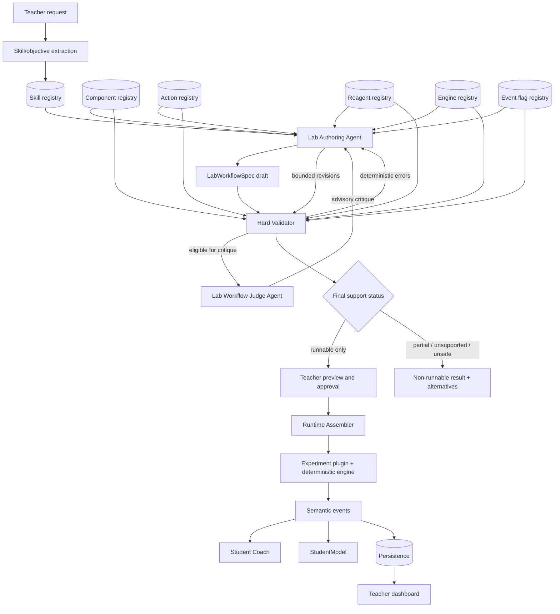

# Composable Lab Runtime

> **Transitional v1 architecture:** This document explains the implemented
> fixed-family Composer foundation and remains a compatibility reference. It is
> not the target runtime dispatch design. New work must follow
> [`../lab-composer-architecture.md`](../lab-composer-architecture.md) and the
> [`LC2 execution pack`](../lab-composer/README.md); do not add another
> family-selected runtime assembler.

## Purpose

The composable runtime evolves LabBench from manually selected static experiment plugins into validated workflows assembled over those plugins. It adds a constrained authoring layer; it does not replace deterministic engines, semantic events, or `ExperimentDefinition.step()`.

The boundary is simple:

> Generated specifications decide which verified capabilities to use and how to teach with them. Deterministic code decides whether the specification is runnable and what happens when a student acts.

No generated text becomes executable code, a chemistry formula, an equipment physics model, or a safety rule.

## Architecture overview



## Registry contracts

Registries are versioned, deterministic application data. Authoring tools may query them but may not write to them at runtime.

### Component registry

Defines verified apparatus capabilities such as `component.burette.v1` and `component.erlenmeyer_flask.v1`. Each entry declares its serializable state contract, allowed action IDs, emitted event types, precision, compatible families, visual adapter, performance tier, and safety restrictions.

Components provide interaction and measurement behavior. They do not contain experiment-specific formulas. A burette can expose fill, dispense, and read actions; the selected titration engine determines the chemical consequence of dispensed titrant.

### Action registry

Defines typed action contracts, parameter schemas, units, limits, compatible component roles, and the adapter that maps a workflow action into a plugin action. Examples include rinse, fill, dispense, transfer, read volume, read temperature, mix, record observation, and submit report.

An allowed action in a workflow is a restriction over a registry action, not a new action definition. Numeric bounds selected by the author are clamped to registry and safety limits during validation.

### Reagent registry

Defines verified reagent identities, concentration/configuration profiles, hazard metadata, compatible containers, permitted engine families, disposal/safety constraints, and availability status. Generated specs reference a reagent profile ID; they do not author a molecular model or arbitrary concentration.

The registry may include safe virtual-only profiles, but the UI must label them accurately and may not infer real-world safety from virtual runnability.

### Engine registry

Maps a lab-family ID to a versioned `ExperimentDefinition`, supported reagent profiles, component/action capabilities, seed templates, observable keys, ground-truth contract, event types, and event flags. A registered family is not runnable until its engine entry and required compatibility tests are present.

Initial intended families are:

- `family.acid_base_titration.v1` — migration target backed by the existing titration truth layer;
- `family.precipitation_solubility.v1` — planned until its deterministic engine and registry contracts are implemented;
- `family.calorimetry.v1` — stretch until its deterministic engine and component support are implemented;
- `family.measurement.v1` — future family for apparatus/precision practice where no chemistry transformation is required.

### Skill registry

Maps teacher-facing objectives to stable skill IDs, supported families, component recommendations, event evidence, assessment modes, coach trigger types, and retry templates. It narrows a broad prompt before the authoring agent selects a workflow.

Legacy event data must remain readable. Proposed canonical aliases include `volumetric_reading` → `meniscus_reading`, `sig_figs` → `significant_figures`, `net_ionic_equation` → `net_ionic_equations`, and `sign_convention` → `calorimetry_sign_convention`. Alias resolution belongs in deterministic registry/version migration code, not an LLM prompt.

### Event flag registry

Defines which stable semantic flags an engine can emit, the event types and skills they support, severity, coach eligibility, positive stay-silent counterpart, and version introduced. A workflow cannot name a coach trigger or rubric evidence flag that is absent from both this registry and the selected engine capability declaration.

New flags continue to require engine tests, coach/eval coverage, and positive stay-silent tests.

## Workflow schema

`LabWorkflowSpec` is the versioned, serializable authoring contract. It contains:

- metadata and teacher objective;
- selected family, engine, and skill IDs;
- component instances and reagent bindings;
- ordered workflow steps and allowed actions;
- expected observations expressed through registered event/observable IDs;
- coach triggers, report rubric, and adaptive retry templates;
- safety constraints;
- validator-owned support status and validation result;
- optional judge critique stored separately from hard validation authority.

The detailed TypeScript-oriented contract and examples live in [lab-workflow-schema.md](../experiments/lab-workflow-schema.md).

## Hard workflow validator

The validator is pure deterministic code. Given a draft plus versioned registry snapshots, it returns stable issue codes and a support status. It performs at least these passes:

1. schema and schema-version validation;
2. resolution of every family, engine, skill, component, action, reagent, event, flag, retry, and safety ID;
3. component-to-action and component-to-component compatibility;
4. reagent-to-container, reagent-to-action, and reagent-to-engine compatibility;
5. engine capability and configuration-profile support;
6. safety-policy evaluation, including restricted components;
7. step graph ordering, prerequisite, required-action, and completion reachability;
8. coach-trigger and rubric-evidence compatibility;
9. seed-template validation and deterministic seed replay when required;
10. Chromebook/performance budget checks declared by the selected components.

Validation decisions are authoritative and reproducible. The validator must not call an LLM or the network. The result includes issue paths, registry versions, a canonical spec hash, and whether preview/assignment is eligible.

## Lab Workflow Judge Agent

The Judge Agent reviews pedagogy after hard validation has established what is real. It can identify weak alignment, confusing instructions, poor rubric evidence, giveaway hints, or classroom friction. Its critique is advisory input to revision. It cannot mark an invalid workflow runnable, waive a safety blocker, or add capabilities.

## Runtime assembler

The runtime assembler accepts only a validated, immutable `runnable` spec whose hash matches its validation result. It:

1. resolves the pinned engine and registry versions;
2. loads the existing experiment definition;
3. instantiates component visual/action adapters from registered component entries;
4. creates engine state from a registered configuration and optional validated seed template;
5. builds the allowed-action policy for the current workflow step;
6. routes each meaningful student action through the engine's `step()` function;
7. projects observable engine state into component views;
8. advances workflow steps from registered semantic events/observations;
9. forwards semantic events to StudentModel, coach triggering, checkpointing, replay, evals, and analytics.

The assembler does not evaluate chemistry, execute generated code, or synthesize missing component behavior. Failure to resolve an exact pinned dependency is a load error, never permission to fall back to a similarly named capability.

## Generated workflow lifecycle

```text
draft_unvalidated
  → deterministic validation
  → judge critique when eligible
  → author revision (maximum two revisions after initial draft)
  → deterministic revalidation after every revision or teacher edit
  → runnable | partially_supported | unsupported | rejected_for_safety
  → teacher preview (runnable only)
  → teacher approval and immutable assignment version
  → student sessions and replay against pinned versions
  → retirement/migration without rewriting historical sessions
```

Validation and critique records are append-only artifacts tied to a spec hash. A teacher edit invalidates the previous validation result until the new hash passes. Assignment persistence stores the exact runnable workflow version rather than a mutable pointer.

## Boundary between generated spec and runtime

| Generated or teacher-editable | Registry-backed and validated | Deterministic-runtime-owned |
|---|---|---|
| Title, learning objective, student-facing instructions | Family, engine, skill, component, action, reagent, event flag, safety, and retry IDs | Chemistry formulas and lookup tables |
| Step order within supported prerequisites | Action parameter ranges and component compatibility | Equipment state transitions and measurement consequences |
| Coach wording strategy and trigger selection from available flags | Reagent profiles and engine configuration IDs | pH, equivalence point, precipitate identity, heat flow, precision truth |
| Rubric wording and weights within policy | Rubric evidence references and scoring limits | Semantic event emission and ground truth |
| Estimated duration and classroom notes | Performance/support eligibility | Session state, replay, StudentModel reducer, deterministic analytics |

Generated specs are data. They cannot import modules, contain formulas/functions, name arbitrary tool calls, mutate registry content, or directly write engine state.

## Relationship to existing experiment plugins

The experiment plugin remains the scientific unit of execution. A workflow is a constrained lesson plan bound to one supported plugin/family for MVP. Multi-engine workflows are a future capability and must not be implied by the initial schema.

The existing acid-base titration plugin already provides the essential truth contract: typed actions, pure state transitions, semantic events, StudentModel evidence, ground truth, and seeded replay. Composition extracts reusable presentation/action primitives around it while leaving its formulas and event semantics intact.

The long-term relationship is:

```text
one deterministic experiment plugin / engine family
  ↳ many validated workflow specs
     ↳ different skill focus, step sequence, coaching, rubric, and retry
```

## Migration path

### 1. Current static titration plugin

Keep `src/experiments/titration/**`, its `ExperimentDefinition.step()` implementation, truth tests, seed behavior, and semantic flags unchanged. Document the current static UI flow as the baseline seed workflow.

### 2. Extract reusable components

Define registry contracts for the existing burette, flask, reagent/indicator bottles, and measurement interactions. Adapters dispatch the existing typed titration actions; they do not relocate formulas into components.

### 3. Represent titration as `LabWorkflowSpec`

Create a checked-in, versioned endpoint-control seed spec referencing only verified IDs. Validate it in unit tests and replay its required steps through the existing engine.

### 4. Assemble titration from the spec

Add an assembler that renders the same student experience from the seed spec. Prove parity in engine actions, events, observable state, coaching triggers, and Chromebook behavior before enabling AI-authored variants.

Only after this path is green should teacher authoring and assignment become runnable. Precipitation and calorimetry examples remain non-runnable reference specs until their engines and components satisfy the same requirements.

## Semantic events remain the shared contract

Composition adds workflow metadata to the event stream; it does not replace semantic evidence. Every event should remain attributable to the engine and include the pinned workflow/spec version in persistence context.

- **Student Coach:** responds only to direct questions or registered event evidence selected by the workflow trigger policy.
- **StudentModel:** folds skill evidence from engine events in memory and checkpoints at the established boundaries.
- **Evaluator:** combines the workflow rubric, student report, deterministic ground truth, and persisted event evidence.
- **Teacher dashboard:** computes readiness and misconception aggregates from persisted rows, grouped by workflow and skill version when needed.
- **Replay/evals:** reconstruct the same engine configuration and workflow gates from pinned versions and seed.

Simulation actions remain local and never wait for authoring, judging, OpenAI, or Supabase.
